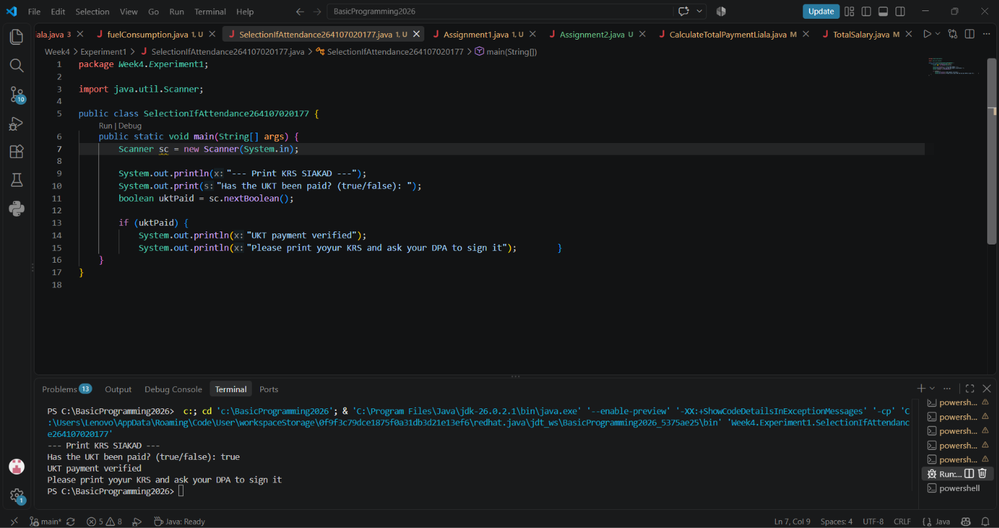
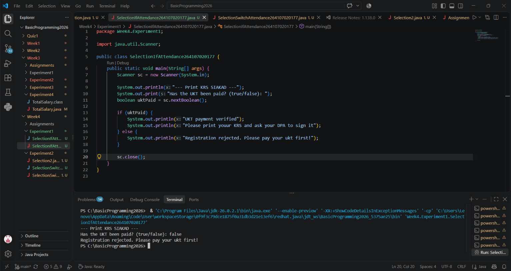
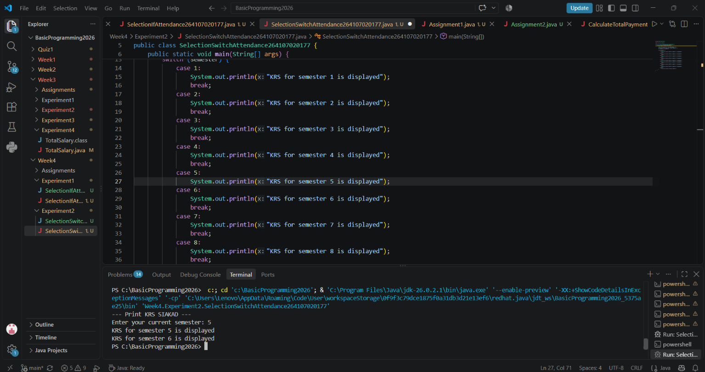
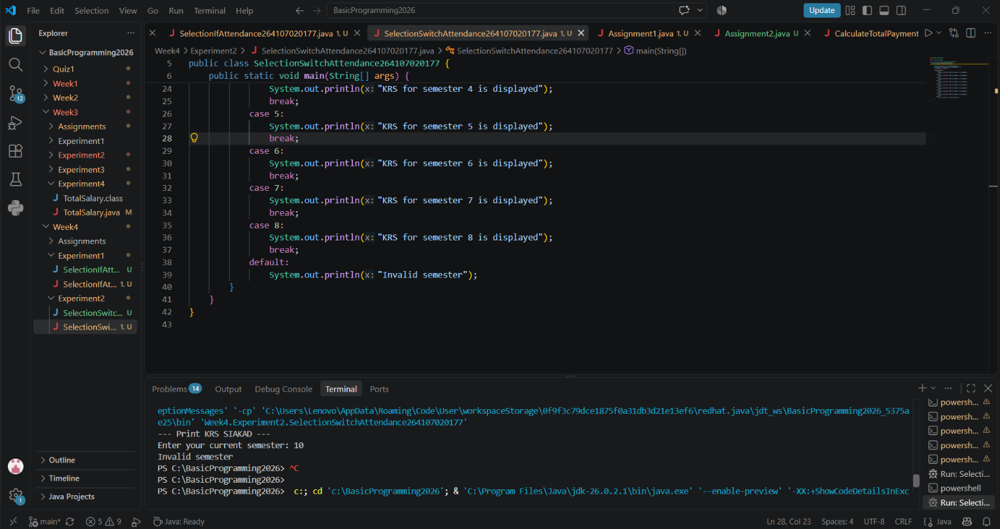
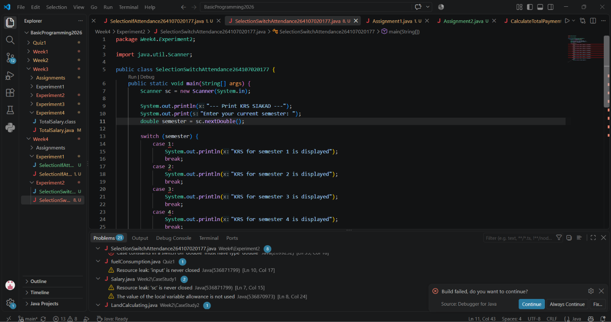
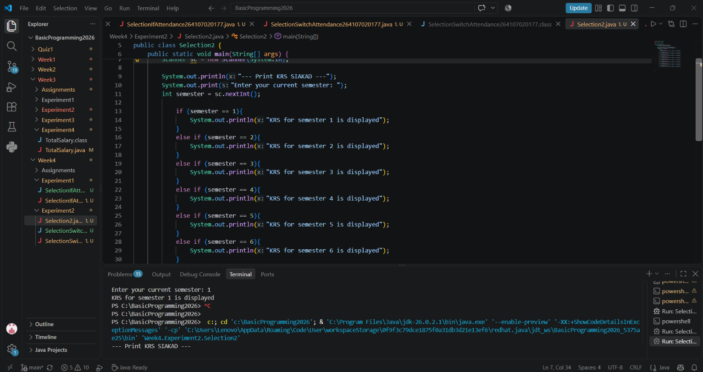
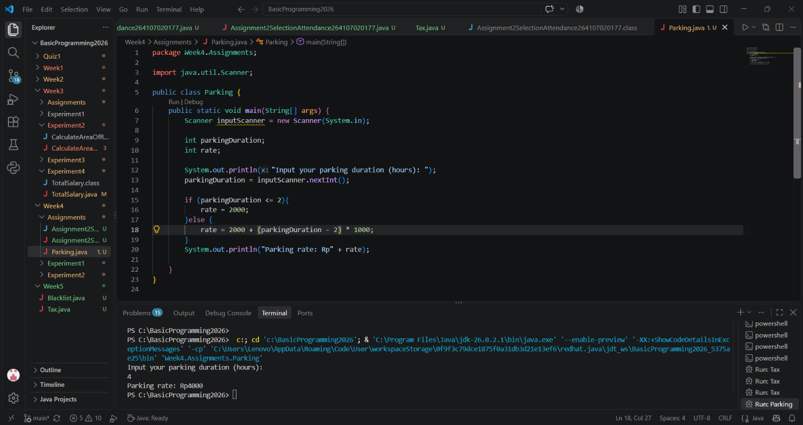
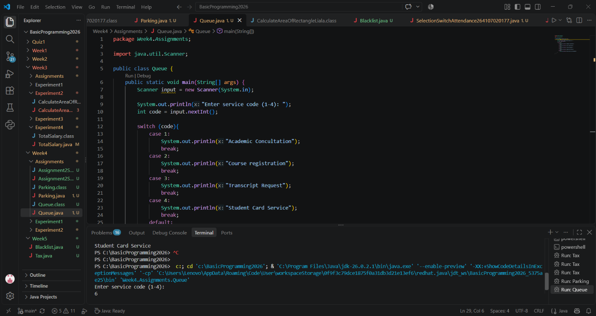

# JOBSHEET 4

#### Name: Liala Virdausi
Class: TI-1I
Student ID Number: 264107020177
Link GitHub: [https://github.com/lialavirda](https://github.com/lialavirda)

---

#### Experience 1: Using IF and IF-ELSE to print the KRS



Questions: 

> 
> 
> 1. What value must you enter so that both lines inside the IF block are printed? Explain why only that value is accepted?

Answer: In Java, the `if (uktPaid)` statement evaluates a `boolean` expression. The code block inside the `if` statement only executes when the condition evaluates to `true`. Because the variable `uktPaid` is a `boolean`, entering `true` sets the condition to `true`, allowing the Java Virtual Machine (JVM) to enter the block and execute both `System.out.println()` statements. Any value that does not evaluate to `true` causes the JVM to skip the block entirely.

> 
> 
> 1. Run the program, then enter **false**. Which lines are printed and which lines are not? Explain the execution flow when the IF condition is false!

Answer: Lines that printed or not printed:

`Has the UKT been paid? (true/false: )`

Nothing else is printed after entering false. Not printed:

`“UKT payment verified”`

`“Please print your KRS and ask your DPA to sign it”` 

- The program reads the input `false` and assigns it to the `uktPaid` variable.
- It reaches the evaluation step: `if (uktPaid)`.
- Since `uktPaid` is `false`, the condition evaluates to `false`.
- The program skips the entire code block enclosed in `{ ... }` after the `if` statement.
- Because there are no further statements or `else` blocks after the `if` structure, the program simply finishes execution and terminates.

> 
> 
> 1. Run the program, then enter **TRUE** (in capital leters) and **yes**. What happen each input? If the program stops with an error, explain the cause!

Answer: 

**— Input: `TRUE` (in capital letters)**

- **Result:** The program stops immediately and throws an error (`InputMismatchException`).
- **Cause:** Java is case-sensitive. The `sc.nextBoolean()` method in Java's `Scanner` class only recognizes `true` and `false` (in lowercase, or case-insensitive variations like `True` depending on locale/parsing, but strict boolean parsing expects valid boolean literal strings). Standard `Scanner.nextBoolean()` expects the exact string representations of `true` or `false`. When passed `TRUE` or `yes`, it fails to parse it into a standard boolean value, resulting in a runtime `java.util.InputMismatchException`.

**— Input: `yes`**

- **Result:** The program stops immediately and throws a `java.util.InputMismatchException`.
- **Cause:** The method `sc.nextBoolean()` specifically expects a boolean text format (`true` or `false`). Since `"yes"` is a regular string that cannot be automatically converted into a `boolean` primitive type, `Scanner` fails to convert the input and throws an exception to prevent invalid data assignment.

> 
> 
> 1. The system needs to give information when the user enters the value false, with the
> output “Registration rejected. Please pay your UKT first”. Modify the program by
> adding an ELSE structure, then show the run results for the inputs true and false!

Answer:



---

#### Experiment 2: SWITCH-CASE to Print the KRS

> 
> 
> 1. Delete the **break**; statement in **case 5**, then compile and run the program again with
> the input 5. Write down the output, then explain the function of break in the
> SWITCH-CASE structure based on your experiment! Put the code back to how it was
> when you are done.

Answer: The `break` statement serves as a control instruction to immediately exit the `switch` block once a matching case has executed. Without `break`, execution continues sequentially into subsequent cases regardless of whether their labels match (a behavior known as **fall-through**).



> 
> 
> 1. Run the program with the input **10**, then with the input **0**. What is the output of these
> two runs? Based on the results, explain the role of **default** and what will happen to
> the program if the default part is deleted!

Answer: **Role of `default`:**

- The `default` label acts as a catch-all block that executes when none of the defined `case` values match the provided input.
- **If `default` is deleted:** When an input doesn't match any `case` (such as `10` or `0`), the program skips the entire `switch` statement without executing anything inside it and continues silently without providing feedback.



> 
> 
> 1. Change the data type of the semester variable to double, then compile the program.
> Does the program compile successfully? Write down the error message and explain its
> cause. List the data types that can be used as the expression in a switch!

Answer: No, it fails at compile time. 
Java's `switch` statement requires discrete, integral, or string values to perform exact equality comparisons. Floating-point types (`double` and `float`) cannot be evaluated precisely due to precision and representation limitations.



> 
> 
> 1. Create a new file named `SelectionIfElseAttendanceNo.java.` Convert the KRS printing program that uses SWITCH-CASE into an IF - ELSE IF - ELSE form. The program output
> must be exactly the same as the SWITCH-CASE version, including for invalid input. In
> your opinion, which one is easier to read for this case, and why?

Answer: **`SWITCH-CASE` is easier to read** for this specific scenario. When comparing a single variable against multiple discrete equality targets (`1` through `8`), `SWITCH-CASE` provides a cleaner, flatter structure without the repetitive variable checking (`semester == ...`) required by `IF - ELSE IF - ELSE`.



---

#### ASSIGNMENTS

> 
> 
> 1. Open the file `SelectionIfAttendanceNo.java` again. Change the IF-ELSE selection
> structure in the program into a Ternary Operator, with the following rules:
> -  The decision result is first stored in a String variable named message, then printed
> using a single `System.out.println()` statement
> - The program output must be exactly the same as the original program
> - Save it with the file name `Assignment1SelectionAttendanceNo.java`
> In your opinion, when is the Ternary Operator better to use than IF-ELSE, and when
> should it not be used?

Answer: 

**When is the Ternary Operator better to use?**
It is better to use the ternary operator when you have a simple, single condition and just want to assign a value to a variable. It makes the code much shorter, cleaner, and easier to read compared to writing a full `if-else` block for just one line of assignment.

**When should it NOT be used?**
It should not be used when you have multiple complex conditions stacked together (nested ternary), as this makes the code very hard to read and debug. Additionally, if you need to execute multiple statements or lines of logic inside a branch, you should stick to a standard `if-else` statement.


> 
> 
> 1. A KRS system validates the number of credits (SKS) taken by a student, where
> maximum number allowed is 24 credits. Implement the flowchart above as a Java
> program using an IF-ELSE selection structure, then save it with the file name
> `Assignment2SelectionAttendanceNo.java`!


> 
> 
> 1. In the Basic Programming class, you made flowcharts and pseudocode for two cases on
> the Exercise slides (page 33). Now implement both of them in Java, with the following
> rules.
> - For Problem 1 — Parking System, use an IF-ELSE selection structure and name the file
> AssignmentParkingAttendanceNo.java
> - For Problem 2 — Academic Queue Machine, use a SWITCH-CASE selection structure
> and name the file: AssignmentQueueAttendanceNo.java. In addition, the program
> must include a default part to handle codes outside 1–4 with the message "Service
> code is not available"





---

### 1. Nusantara Pay — Transaction Security System

You are tasked with building an automated module for the *Nusantara Pay* app to evaluate user transactions instantly. The system must assign a single final status based on the following strict order of security priority:

1. **`REJECTED_BLACKLIST`**: Account status is marked as `"BLACK-LISTED"`.
2. **`REJECTED_SALDO`**: Transaction amount exceeds available balance.
3. **`REJECTED_LIMIT`**: Transaction amount exceeds the daily limit ($10,000).
4. **`FLAGGED_FRAUD`**: Transaction originates from abroad (`isBedaNegara == true`) **and** the amount is over $2,000.
5. **`REQUIRE_OTP_NIGHT`**: Transaction occurs between 00:00 and 04:00 AM **and** the amount is over $1,000.
6. **`REQUIRE_OTP_SUSPICIOUS`**: Account status is `"SUSPICIOUS"` **and** the transaction amount is over $500.
7. **`APPROVED`**: The transaction is safe and triggers none of the above conditions.

```java
package Week5;

public class NusantaraPay {
    public static void main(String[] args) {
        String finalStatus = "";
        String accountStatus = "";
        int transactionAmount = 1000;
        int balance = 250000;
        int hour = 14;
        boolean isOverseas = true;
        if(accountStatus.equalsIgnoreCase("BLACK-LISTED")){
            finalStatus = "REJECTED_BLACKLIST";
        }else if(transactionAmount>balance){
            finalStatus = "REJECTED_SALDO";
        }else if(transactionAmount>10000){
            finalStatus = "REJECTED_LIMIT";
        }else if(isOverseas && transactionAmount>2000){
            finalStatus = "FLAGGED_FRAUD";
        }else if(hour>=0 && hour<4 && transactionAmount>1000){
            finalStatus = "REQUIRE_OTP_NIGHT";
        }else if(accountStatus.equalsIgnoreCase("SUSPICIOUS") && transactionAmount>500){
            finalStatus = "REQUIRE_OTP_SUSPICIOUS";
        }else{
            finalStatus = "APPROVED";
        }
        System.out.println(finalStatus);
    }
}
```

---

### 2. ER Harapan Kita Hospital — Emergency Room Allocation

An Emergency Room (ER) needs an automated system to allocate patient care rooms based on health indicators entered by triage nurses. Create a module to determine the destination room using the following criteria:

- **`ICU`**: Oxygen saturation ($SpO_2$) < 85% **and** ICU beds are available (`sisaBedICU > 0`).
- **`UGD_VENTILATOR_MOBIL`**: $SpO_2$ < 85% **but** ICU beds are full (`sisaBedICU == 0`).
- **`RESUSITASI_UGD`**: $SpO_2$ is between 85%–89%, **or** systolic blood pressure is abnormal (under 90 / over 180 mmHg), **or** the patient is not fully conscious.
- **`HCU_ISOLASI`**: ($SpO_2$ is between 90%–94% **or** body temperature > $39^\circ\text{C}$) **and** the patient has comorbidities **and** is aged $\ge 65$.
- **`RAWAT_INAP_UMUM`**: $SpO_2$ is between 90%–94% **or** respiratory rate exceeds 24 breaths/min.
- **`RAWAT_JALAN`**: Patient is stable and meets none of the criteria above.

```java
package Week5;

import java.util.Scanner;

public class HarapanKitaHospital {
    public static void main(String[] args) {
        Scanner input = new Scanner(System.in);
        String destinationRoom = "";

        System.out.print("SpO2 (%): ");
        double spo2 = input.nextDouble();
        System.out.print("Sisa bed ICU: ");
        int sisaBedICU = input.nextInt();
        System.out.print("Systolic blood pressure (mmHg): ");
        int systolic = input.nextInt();
        System.out.print("Fully conscious? (true/false): ");
        boolean isConscious = input.nextBoolean();
        System.out.print("Body temperature (C): ");
        double temperature = input.nextDouble();
        System.out.print("Has comorbidities? (true/false): ");
        boolean hasComorbidity = input.nextBoolean();
        System.out.print("Age: ");
        int age = input.nextInt();
        System.out.print("Respiratory rate (breaths/min): ");
        int respiratoryRate = input.nextInt();

        if(spo2<85 && sisaBedICU>0){
            destinationRoom = "ICU";
        }else if(spo2<85 && sisaBedICU==0){
            destinationRoom = "UGD_VENTILATOR_MOBIL";
        }else if((spo2>=85 && spo2<90) || systolic<90 || systolic>180 || !isConscious){
            destinationRoom = "RESUSITASI_UGD";
        }else if(((spo2>=90 && spo2<95) || temperature>39) && hasComorbidity && age>=65){
            destinationRoom = "HCU_ISOLASI";
        }else if((spo2>=90 && spo2<95) || respiratoryRate>24){
            destinationRoom = "RAWAT_INAP_UMUM";
        }else{
            destinationRoom = "RAWAT_JALAN";
        }
        System.out.println(destinationRoom);
    }
}
    

```

---

### 3. Tax Consultant — Progressive Income Tax Calculator

Help the finance team calculate annual Progressive Income Tax (PPh 21) based on an employee's Taxable Income (PKP) across tiered tax brackets:

- **PKP $\le$ 0**: Tax-free (Rp 0).
- **PKP up to Rp 60 Million**: 5% tax on total PKP.
- **PKP > Rp 60 Million to Rp 250 Million**: Maximum tax from the first bracket (5% $\times$ 60 Million) plus 15% on the remaining PKP above 60 Million.
- **PKP > Rp 250 Million to Rp 500 Million**: Accumulated tax from previous brackets plus 25% on the remaining PKP above 250 Million.
- **PKP above Rp 500 Million**: Accumulated tax from previous brackets plus 30% on the remaining PKP above 500 Million

```java
package Week5;

import java.util.Scanner;

public class Tax {
    public static void main(String[] args) {
        Scanner input = new Scanner(System.in);
        System.out.print("Masukkan PKP (Rp): ");
        double income = input.nextDouble();
        double tax;
        if(income<=0){
            tax=0;
        }else if(income>0 && income<=60000000){
            tax=0.05*income;
        }else if(income>60000000 && income<=250000000){
            tax=(0.05*60000000)+(0.15*(income-60000000));
        }else if(income>250000000 && income<=500000000){
            tax=(0.05*60000000)+(0.15*190000000)+(0.25*(income-250000000));
        }else{
            tax=(0.05*60000000)+(0.15*190000000)+(0.25*250000000)+(0.30*(income-500000000));
        }
        System.out.println("PPh 21: Rp " + tax);
    }
}
```
