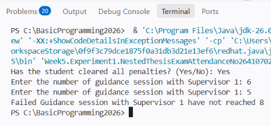

# JOBSHEET 6

### Student Identity

Name: Liala Virdausi

Student ID Number (NIM): 264107020177

Class / Attendannce No: 1I / 17

---

## 1. PRACTICUM OBJECTIVES

---

- Students can solve problems and case studies using nested selection statements.
- Students can apply nested selection statements in Java programs.
- Students can apply the logical operators &&, ||, and ! in selection structures.
- EXPERIMENT RESULT & ANALYS

---

## 2. Experiment 1: Nested IF to Check Thesis Exam Requirements

A student wants to register for the thesis exam. The SIMTA system first checks an administrative requirement: the student must have no outstanding penalties. If this requirement is met, the system then checks the guidance log. To register for the exam, the student must have at least 8 guidance sessions with Supervisor 1 and at least 4 guidance sessions with Supervisor 2. If all requirements are met, the student can proceed to register for the thesis exam. If not, the system shows the reason for failure. Based on this case, build the Java program using the steps below.

#### 2.1 Java Program Code

```jsx
package Week5.Experiment1;

import java.util.Scanner;

public class NestedThesisExamAttendanceNo264107020177 {

public static void main(String[] args) {

Scanner sc = new Scanner(System.in);

    String message;
    System.out.print("Has the student cleared all penalties? (Yes/No): ");
    String noPenalty = sc.nextLine().trim();

    System.out.print("Enter the number of guidance session with Supervisor 1: ");
    int guidanceCount1 = sc.nextInt();
    System.out.print("Enter the number of guidance session with Supervisor 1: ");
    int guidanceCount2 = sc.nextInt();

    if (noPenalty.equalsIgnoreCase("Yes")) {
        if (guidanceCount1 >= 8 && guidanceCount2 >= 4) {
            message = "All requirements met. The student may register for the thesis exam";
        } else if (guidanceCount1 < 8 && guidanceCount2 < 4) {
            message ="Failed! Guidance sessions with Supervisor 1 are below 8 and Supervisor 2 are below 4";
        } else if (guidanceCount1 < 8) {
            message = "Failed Guidance session with Supervisor 1 have not reached 8";
        } else {
            message = "Failed Guidance session with Supervisor 2 have not reached 4";
        }
    } else {
        message = "Failed! The student still has an outstanding penalty";
    }
    System.out.println(message);
 }

}
```

#### 2.2 Ouput Screenshot



#### 2.3 Test Table

| No. | Input | Output | Status |
| --- | --- | --- | --- |
| 1 | Yes, 6, 5 | Failed! Guidance sessions with Supervisor 1 have not reached 8 | Invalid |
| 2 | Yes, 8, 4 | All requirements met. The student may register for the thesis exam | Valid |
| 3 | Yes, 5, 2 | Failed! Guidance sessions with Supervisor 1 are below 8 and Supervisor 2 are below 4 | Invalid |
| 4 | Yes, 8, 2 | Failed! Guidance sessions with Supervisor 2 have not reached 4 | Invalid |
| 5 | No, 8, 2 | Failed! The student still has an outstanding penalty | Invalid |

#### 2.4 Answered Questions

1. What happens if the student answers "No" to the penalty-clearance question? Why?

Answer: The condition `noPenalty.equalsIgnoreCase(”Yes”)` becomes false, so Java skips the entire inner block (all the guidance checks) and runs the outer `else`. The output is: The penalty check is the first-level gate. Clearing penalties is a mandatory administrative requirement, so if it fails, the guidance counts no longer matter, even if the student has 10 and 6 sessions.

```jsx
Failed! The student still has an outstanding penalty
```

Note that the program still asks for both guidance counts before the `if`, because steps 5 and 6 read all input first. Those values are simply ignored when the answer is "No".

1. Explain the meaning of the following code snippet!
`if (guidanceCount1 >= 8 && guidanceCount2 >= 4) {`

Answer: 

This checks whether the student has met the guidance requirement for **both** supervisors:

- `guidanceCount1 >= 8`: at least 8 sessions with Supervisor 1.
- `guidanceCount2 >= 4`: at least 4 sessions with Supervisor 2.
- `&&` (logical AND): the condition is `true` only if both comparisons are true. If either one is false, the whole condition is false.

If it is `true`, the message "All requirements met. The student may register for the thesis exam" is stored in `message`. If it is `false`, Java moves on to the `else if` branches to find out which part failed.

1. Describe the full flow of checking the student's requirements from start to finish. Explain
step by step for every condition!

Answer: 

1. **Input.** The program reads `noPenalty` (Yes/No), `guidanceCount1` and `guidanceCount2`. `trim()` removes extra spaces around the typed answer.
2. **Level 1: `noPenalty.equalsIgnoreCase("Yes")`**
    - `equalsIgnoreCase` ignores letter case, so "yes", "YES" and "Yes" all pass.
    - **False:** `message = "Failed! The student still has an outstanding penalty"`, and nothing in the inner block runs.
    - **True:** go to Level 2.
3. **Level 2, condition A: `guidanceCount1 >= 8 && guidanceCount2 >= 4`**
    - **True:** both guidance requirements are met, so `message = "All requirements met. The student may register for the thesis exam"`. The rest of the chain is skipped.
    - **False:** at least one is not met, so go to condition B.
4. **Condition B: `guidanceCount1 < 8 && guidanceCount2 < 4`**
    - **True:** both counts are insufficient, so `message = "Failed! Guidance sessions with Supervisor 1 are below 8 and Supervisor 2 are below 4"`.
    - **False:** only one is insufficient, so go to condition C.
5. **Condition C: `guidanceCount1 < 8`**
    - **True:** since we already know both are not failing together, the problem is Supervisor 1 only, so `message = "Failed! Guidance sessions with Supervisor 1 have not reached 8"`.
    - **False:** go to the final `else`.
6. **Final `else`.** The only remaining case is that Supervisor 1 is fine (>= 8) but Supervisor 2 is not, so `message = "Failed! Guidance sessions with Supervisor 2 have not reached 4"`.
7. **Output.** `System.out.println(message)` prints the single message that was assigned.

**Check with the sample output** (Yes, 6, 5):

- Level 1: "yes" passes.
- A: `6 >= 8` is false, so A is false.
- B: `6 < 8` is true but `5 < 4` is false, so B is false.
- C: `6 < 8` is true, so the output is "Failed! Guidance sessions with Supervisor 1 have not reached 8".

---

## 2. Experiment  2: Logical Operators to Determine Campus WiFi Access

The campus WiFi can only be used by students or lecturers whose accounts are not blocked. The program receives information on whether the user is a student, whether the user is a lecturer, and whether the user's account is currently blocked. Access is granted if the user is a student or a lecturer,
and the account is not blocked. This experiment practices the logical operators `&&` (AND), `||` (OR), and `!` (NOT).

### 2.1 Java Program Code

```jsx
package Week5.Experiment2;

import java.util.Scanner;

public class LogicalOperatorWifiAttendanceNO264107020177 {
    public static void main(String[] args) {
    Scanner sc = new Scanner(System.in);
    
    boolean isStudent;
    boolean isLecturer;
    boolean isBlocked;

    System.out.print("Is the user a student? (true/false): ");
    isStudent = sc.nextBoolean();

    System.out.print("Is the user a lecturer? (true/false): ");
    isLecturer = sc.nextBoolean();

    System.out.print("Is the account cureently blocked? (true/false): ");
    isBlocked = sc.nextBoolean();

    if ((isStudent || isLecturer) && !isBlocked){
        System.out.println("Wifi access granted");
    } else {
        System.out.println("Wifi access denied");
    }
    }
    
}

```

### 2.2 Output Screenshot


### 2.3 Test Table

| Test | isStudent | isLecturer | isBlocked |
| --- | --- | --- | --- |
| 1 | true | false | false |
| 2 | false | true | false |
| 3 | true | false | true |
| 4 | false | false | false |

### 2.4 Answered Questions

1. Explain the function of the `||`, `&&` and `!` operators in the condition above!

Answer: 

- `||` (OR) is true if at least one side is true. `isStudent || isLecturer` is true if the user is a student, a lecturer, or both.
- `&&` (AND) is true only if both sides are true. Here it requires the user to be a student or lecturer, and also not blocked.
- `!` (NOT) reverses a boolean value. `!isBlocked` is true when the account is not blocked.
1. Why can a lecturer still get access when `isStudent = false` ?

Answer: `||` only needs one side to be true. With `isStudent = false` and `isLecturer = true`, `isStudent || isLecturer` is still true. If the account is not blocked, `!isBlocked` is also true, so `true && true` gives access.

1. Change `||` to `&&`. Run the program again, using test data 1 and data 2. What happens, and why?

Answer: The condition becomes `(isStudent && isLecturer) && !isBlocked`.

- Test 1 (true, false, false): `true && false` is false, so the output is "WiFi access denied".
- Test 2 (false, true, false): `false && true` is false, so the output is "WiFi access denied".

Both were granted before. Now the user must be a student and a lecturer at the same time, which is rare. A user who is only one of the two is wrongly rejected, so the logic no longer matches the requirement.

1. In the expression `isStudent || isLecturer`, when does `isLecturer` not need to be evaluated? Explain using short-circuit evaluation.

Answer: Java uses short-circuit evaluation. For `||`, if the left operand is already `true`, the whole expression must be true. So when `isStudent = true`, `isLecturer` is skipped. It is only evaluated when `isStudent = false`.

1. In the expression `(isStudent || isLecturer) && !isBlocked`, when does `!isBlocked` not need to be evaluated? Explain.

For `&&`, if the left operand is `false`, the whole expression must be false. So when `(isStudent || isLecturer)` is `false`, meaning the user is neither a student nor a lecturer, `!isBlocked` is skipped. Access is denied no matter what the blocked status is. `!isBlocked` is only evaluated when the left side is `true`.

---

## 3. Experiment 3: Nested IF and Logical Operators to Determine Laboratory Access

A student may use the laboratory outside class hours if their status is active and they are not currently under sanction. If this requirement is met, the system performs a second check. Laboratory access is granted if the student has lecturer permission or is a lab assistant. This case combines nested selection with logical operators.

### 3.1 Java Program Code

```jsx
package Week5.Experiment3;

import java.util.Scanner;

public class NestedLabAccessAttendanceNo264107020177 {
    public static void main(String[] args) {
        Scanner sc = new Scanner(System.in);
        boolean isActiveStudent;
        boolean isSanctioned;
        boolean hasLecturerPermit;
        boolean isLabAssistant;

        System.out.print("Is the student is an active student (true/false): ");
        isActiveStudent = sc.nextBoolean();

        System.out.print("Is the user is sanctioned? (true/false)?: ");
        isSanctioned = sc.nextBoolean();

        System.out.print("Is the user has lecturer permit (true/false): ");
        hasLecturerPermit = sc.nextBoolean();

        System.out.print("Is the user is lab assistant (true/false): ");
        isLabAssistant = sc.nextBoolean();

        if (isActiveStudent && !isSanctioned) {
            if (hasLecturerPermit || isLabAssistant) {
                System.out.println("Laboratory access granted");
            } else {
                System.out.println("Access denied: Lecturer permission or lab assistant status required");
            }
        } else {
            System.out.println("Access denied: student status does not meet the requirement");
        }
    }
}

```

### 3.2 Output Screenshot


### 3.3 Test Table

| No | isActiveStudent | isSanctioned | hasLecturerPermit | isLabAssistant | Output |
| --- | --- | --- | --- | --- | --- |
| 1 | true | false | true | false | Laboratory access granted |
| 2 | true | false | false | true | Laboratory access granted |
| 3 | true | false | false | false | Access denied: lecturer permission or lab assistant status required |
| 4 | true | true | true | true | Access denied: lecturer permission or lab assistant status required |
| 5 | false | false | true | true | Access denied: lecturer permission or lab assistant status required |

### 3.4 Answered Questions

1. Why is the check hasLecturerPermit || isLabAssistant placed inside the first IF?

Answer: The requirement has two stages. The student must first be active and not sanctioned. Only then does the system check for permission or lab assistant status. Placing the second check inside the first IF means it runs only for students who passed the first stage. An inactive or sanctioned student is rejected immediately, even if they have a permit or are a lab assistant.

1. Explain the function of the &&, ||, and ! operators in this program.

Answer: 

- `&&` (AND) in `isActiveStudent && !isSanctioned` requires both conditions to be true: the student is active and not sanctioned.
- `!` (NOT) in `!isSanctioned` reverses the value, so the condition is true when the student is not under sanction.
- `||` (OR) in `hasLecturerPermit || isLabAssistant` needs only one side to be true. A permit is enough, and so is being a lab assistant.
1. Can the access requirement be written as a single condition: isActiveStudent &&
!isSanctioned && (hasLecturerPermit || isLabAssistant)? Explain whether the
final access decision stays the same.

Answer: Yes. `isActiveStudent && !isSanctioned && (hasLecturerPermit || isLabAssistant)` gives the same access decision for all 16 input combinations. Access is granted only when the student is active, not sanctioned, and has a permit or is a lab assistant. The parentheses matter. Without them, `&&` binds tighter than `||`, so the meaning would change. The only difference is that the single condition cannot tell the user why access was denied.

1. What is the advantage of using Nested IF in this case, compared to a single IF, if the system
needs to show different reasons for denial?

Answer:  With nested IF, each level has its own `else`, so the program can print a different denial reason for each failure. In this program, the outer `else` says the student status does not meet the requirement. The inner `else` says lecturer permission or lab assistant status is required. A single IF has only one `else`, so every denial would get the same generic message. Nested IF also mirrors the two-stage logic of the requirement, which makes the code easier to read.

1. Create one input combination that causes access to be denied at the first level, and one that
causes it to be denied at the second level.

Answer: 

- Denied at the first level: `isActiveStudent = false, isSanctioned = false, hasLecturerPermit = true, isLabAssistant = true`. The student is not active, so the outer condition fails. The output is "Access denied: student status does not meet the requirement".
- Denied at the second level: `isActiveStudent = true, isSanctioned = false, hasLecturerPermit = false, isLabAssistant = false`. The student passes the first check but has neither a permit nor lab assistant status. The output is "Access denied: lecturer permission or lab assistant status required".

---

## ASSIGNMENTS

### 1. Implement the flowchart you created in Exercise 2 of Week 6 for the bookstore discount system as a Java program. The program must use nested selection statements (Nested IF). Use logical operators where needed.

- **Flowchart:**


- **Discount rules (from the flowchart logic)**

| Book type | Base discount | Additional |
| --- | --- | --- |
| Dictionary | 10% | +2% if qty > 2 |
| Novel | 7% | +2% if qty > 3, otherwise +1% |
| Other | 0% | 5% if qty > 3 |
- The nested IF is the type check (outer) and the quantity check (inner) inside the main `if`.
- Logical operators used: `&&` for validating input and the Wednesday condition.
- The price input is needed because the total to pay can't be computed from type and quantity alone.
- If your flowchart has no Wednesday check, just remove the `wednesday` variable and its conditions.

- **Java Code Program:**

```jsx
package Week5.Assignments;

import java.util.Scanner;

public class Task1BookstoreDiscount {
    public static void main(String[] args) {
        Scanner sc = new Scanner(System.in);

        System.out.print("Is today Wednesday? (1 = yes, 0 = no): ");
        int wednesday = sc.nextInt();

        System.out.println("Book type: 1 = Dictionary, 2 = Novel, 3 = Other");
        System.out.print("Enter book type: ");
        int type = sc.nextInt();

        System.out.print("Enter number of books: ");
        int qty = sc.nextInt();

        System.out.print("Enter price per book: ");
        double price = sc.nextDouble();

        double discountPercent = 0;

        // Logical operators: valid input AND it is Wednesday
        if (wednesday == 1 && qty > 0 && type >= 1 && type <= 3) {

            if (type == 1) {                    // Dictionary
                discountPercent = 10;
                if (qty > 2) {
                    discountPercent += 2;
                }
            } else if (type == 2) {             // Novel
                discountPercent = 7;
                if (qty > 3) {
                    discountPercent += 2;
                } else {
                    discountPercent += 1;
                }
            } else {                            // Other books
                if (qty > 3) {
                    discountPercent = 5;
                }
            }

        } else if (wednesday != 1 && qty > 0 && type >= 1 && type <= 3) {
            System.out.println("No discount: discounts only apply on Wednesday.");
        } else {
            System.out.println("Invalid input.");
            sc.close();
            return;
        }

        double subtotal = price * qty;
        double discountAmount = subtotal * discountPercent / 100;
        double totalPay = subtotal - discountAmount;

        System.out.println("Discount        : " + discountPercent + "%");
        System.out.println("Discount amount : " + discountAmount);
        System.out.println("Total to pay    : " + totalPay);

        sc.close();
    }
}
```

- **Output Screenshot**
    
    
    

---

### 2. Write a Java program for a lab-assistant candidate selection system based on the following rules:

- A student may take part in the selection if their status is active and they are not currently under academic sanction.
- If this requirement is met, the student must also meet the next requirement: a minimum grade of 80 in Basic Programming, or a programming competency certificate.
- If both requirements are met, the student will be called for an interview. The student is accepted as an assistant if the interview score is at least 75.
- The program must show the reason if the student fails at any stage of the selection.
- Use nested selection and logical operators. Save the file as `Task2AssistantSelectionAttendanceNo.java`

```jsx
package Week5.Assignments;

import java.util.Scanner;

public class Task2AssistantSelectionAttendance26410720177 {
    public static void main(String[] args) {
        Scanner input = new Scanner(System.in);
        
        System.out.print("Student name: ");
        String name = input.nextLine();
        System.out.print("Is the student active? (true/false): ");
        boolean isActiveStudent = input.nextBoolean();
        System.out.print("Is the student under academic sanction? (true/false): ");
        boolean isAcademicallySanctioned = input.nextBoolean();

        System.out.println("\n===== SELECTION RESULT: " + name + " =====");

        // Stage 1: administrative requirements
        if (isActiveStudent && !isAcademicallySanctioned) {
            System.out.print("Basic Programming grade (0-100): ");
            double grade = input.nextDouble();
            System.out.print("Has a programming competency certificate? (true/false): ");
            boolean hasCertificate = input.nextBoolean();

            // Stage 2: academic requirements
            if (grade >= 80 || hasCertificate) {
                System.out.println("Stage 2 passed. Called for an interview!");
                System.out.print("Interview score (0-100): ");
                double interview = input.nextDouble();

                // Stage 3: interview
                if (interview >= 75) {
                    System.out.println("RESULT: ACCEPTED as lab assistant.");
                } else {
                    System.out.println("RESULT: REJECTED as lab assistant.");
                    System.out.println("Reason: interview score " + interview
                            + " is below the minimum requirement of 75.");
                }
            } else {
                System.out.println("RESULT: NOT ELIGIBLE for an interview.");
                System.out.println("Reason: Basic Programming grade is below 80 and no programming competency certificate.");
            }
        } else {
            System.out.println("RESULT: NOT ELIGIBLE to take part in the selection.");
            if (!isActiveStudent && isAcademicallySanctioned) {
                System.out.println("Reason: Student is not active and is under academic sanction!");
            } else if (!isActiveStudent) {
                System.out.println("Reason: Student is not active!");
            } else {
                System.out.println("Reason: Student is currently under academic sanction!");
            }
        }

        input.close();
    }
}
```

- **Output Screenshot**
    
    
    

---

## CONCLUSION

- **Nested selection:** correct. The inner condition is checked only when the outer one is met, and this lets you give a specific reason for each failure, for example in the thesis exam requirements checker.
- **`&&`, `||`, `!`:** correct. All three combine several conditions into one expression.
- **Short-circuit evaluation:** correct. `&&` skips the second operand when the first is `false`, and `||` skips it when the first is `true`. This applies only to `&&` and `||`, not to `&` and `|`.
- **Order of conditions and precedence:** correct. The precedence is `!`, then `&&`, then `||`, so use parentheses to make the intent clear, for example `(a || b) && c`.
- **`Scanner`:** correct. After `nextInt()` or `nextDouble()`, a leftover newline stays in the buffer, so call `nextLine()` before reading a `String` with `nextLine()`.